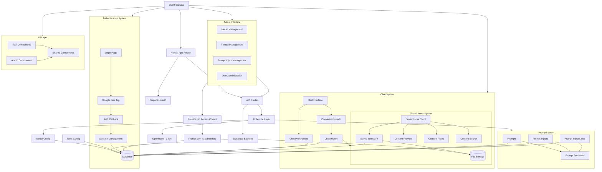
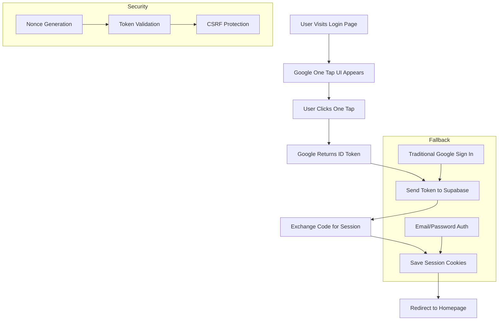

# System Patterns

## Architecture Overview

## Core Technical Patterns

### Authentication Flow

- Multiple authentication methods:
  - Email/password authentication
  - Google One Tap authentication
  - Traditional Google OAuth flow
- Protected routes require valid session
- Auth state managed through middleware
- Middleware checks for authentication and redirects to /login if not authenticated
- Admin routes check for admin privileges through profiles table

#### Google One Tap Implementation

- Nonce-based security for Google One Tap
- FedCM support for Chrome's third-party cookie phase-out
- Automatic session refresh
- Secure cookie handling
- Multiple sign-in options
- Seamless authentication experience

### Data Flow

1. User input captured in React components
2. Server actions process requests
3. AI service layer handles model selection and prompts
4. OpenRouter client generates AI content
5. Results rendered and optionally stored
6. Chat history persisted to database
7. User preferences applied to interactions

### Saved Items Architecture

- Global saved items interface for unified content management
- Content type-specific preview components
- Filtering and search capabilities
- Content organization features
- Bulk operations support
- Integration with tool-specific content (flowcharts, conversations, etc.)

### Component Architecture

- Saved Items Components
  - SavedItemsClient: Main interface for saved content
  - ContentPreview: Type-specific content previews
  - ContentFilters: Content filtering system
  - ContentSearch: Search functionality
  - ContentOrganizer: Content organization features

- Authentication Components
  - GoogleOneTap: Handles Google One Tap UI and auth flow
  - Traditional sign-in options
  - Auth callback handling
  - Session management

- Chat System Components
  - ChatInterface: Reusable chat component
  - ConversationsAPI: Handles chat persistence
  - ChatHistory: Manages conversation storage
  - ChatPreferences: User-specific settings

- Shared UI components in components/shared/
  - Button with variants
  - Card with header and content
  - Form inputs (Select, Textarea)
  - Feedback components (Error, Success, Loading)
  - Navigation components (NavDropdown, AdminDropdown)
- Tool-specific components in app/ directory
- Admin components in app/admin/ directory
- Utility functions in utils/
- Type definitions in /lib/types/

### AI Service Layer

- Model configuration in lib/ai/config/
  - Database-driven model definitions and metadata
  - Task-specific model selection
  - Model caching for performance
  - Admin interface for model management
- Prompt management in lib/ai/config/
  - Database-driven prompt definitions
  - Prompt injects for reusable prompt components
  - Prompt linking system for composition
  - Prompt caching for performance
  - Admin interfaces for prompt and inject management
  - Prompt processing with inject substitution
- Prompt templates in lib/ai/prompts/
  - Task-specific prompts
  - Prompt variants
  - Legacy file-based prompts
- API clients in lib/ai/clients/
  - OpenRouter client
  - Future AI service clients

### Chat System Architecture

- Conversation Management
  - Integration with saved items system
  - Persistent chat history
  - User-specific conversations
  - Multiple conversation support
  - Chat preferences and settings
- API Integration
  - Conversations endpoint
  - History retrieval
  - Preference management
- Database Schema
  - Conversations table
  - Messages table
  - User preferences table
- Security
  - User-scoped access
  - Data privacy
  - Rate limiting

### State Management

- Server components for initial state
- Client components for interactive features
- Supabase real-time updates where needed
- Chat state persistence
- Authentication state management

### Error Handling

- Dedicated error page component
- Consistent error boundary implementation
- User-friendly error messages
- Chat-specific error states
- Authentication error handling

## Design Patterns

### UI/UX Patterns

- Consistent layout structure
- Responsive design with Tailwind
- Progressive enhancement
- Accessibility-first approach
- Chat interface conventions
- Authentication UI patterns

### Code Organization

- Feature-based directory structure
- Clear separation of concerns
- Type-safe interfaces
- Modular component design

### Shared Chat Interface Pattern

- Reusable `ChatInterface` component in `components/shared/`
- Configurable with `apiEndpoint`, `systemPromptKey`, `modelKey`
- Handles chat history, input, and AI interaction
- Used in tool-specific pages (e.g., `/handbook/page.tsx`)
- Conversation persistence support
- User preference integration

## Security Patterns

- Environment variable protection
- API route authentication
- Input validation
- Rate limiting
- CORS policies
- Row-level security in Supabase
- Service role access pattern:
  - Enhanced Supabase client with service role option
  - Selective use of service role for admin operations
  - API routes bypass authentication when needed
  - Protected database tables accessed via service role
  - Prompt and model management using service role
- Role-based access control:
  - is_admin flag in profiles table
  - Admin-specific navigation menu
  - Admin-only API endpoints
  - Row-level security policies for admin operations
  - Admin-only access to prompt and model management
- Chat security:
  - User-scoped conversations
  - Message sanitization
  - Access control
  - Data privacy
- Authentication security:
  - Nonce-based token validation
  - CSRF protection
  - Secure session management
  - Cookie security
  - FedCM support
