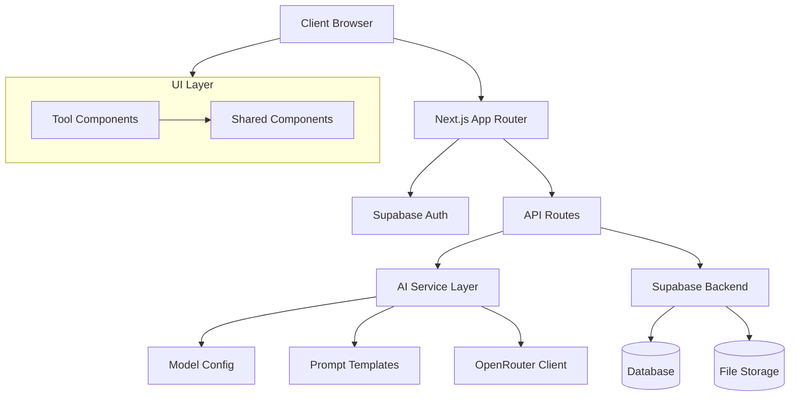

# System Patterns

## Architecture Overview

## Core Technical Patterns

### Authentication Flow

- Supabase handles user authentication
- Protected routes require valid session
- Auth state managed through middleware
- Middleware checks for authentication and redirects to /login if not authenticated

### Data Flow

1. User input captured in React components
2. Server actions process requests
3. AI service layer handles model selection and prompts
4. OpenRouter client generates AI content
5. Results rendered and optionally stored

### Component Architecture

- Shared UI components in components/shared/
  - Button with variants
  - Card with header and content
  - Form inputs (Select, Textarea)
  - Feedback components (Error, Success, Loading)
- Tool-specific components in app/ directory
- Utility functions in utils/
- Type definitions in types/

### AI Service Layer

- Model configuration in lib/ai/config/
  - Model definitions and metadata
  - Task-specific model selection
- Prompt templates in lib/ai/prompts/
  - Task-specific prompts
  - Prompt variants
- API clients in lib/ai/clients/
  - OpenRouter client
  - Future AI service clients

### State Management

- Server components for initial state
- Client components for interactive features
- Supabase real-time updates where needed

### Error Handling

- Dedicated error page component
- Consistent error boundary implementation
- User-friendly error messages

## Design Patterns

### UI/UX Patterns

- Consistent layout structure
- Responsive design with Tailwind
- Progressive enhancement
- Accessibility-first approach

### Code Organization

- Feature-based directory structure
- Clear separation of concerns
- Type-safe interfaces
- Modular component design

### Shared Chat Interface Pattern

- Reusable `ChatInterface` component in `components/shared/`
- Configurable with `apiEndpoint`, `systemPromptKey`, `modelKey`
- Handles chat history, input, and AI interaction
- Used in tool-specific pages (e.g., `/handbook/page.tsx`)

## Security Patterns

- Environment variable protection
- API route authentication
- Input validation
- Rate limiting
- CORS policies
