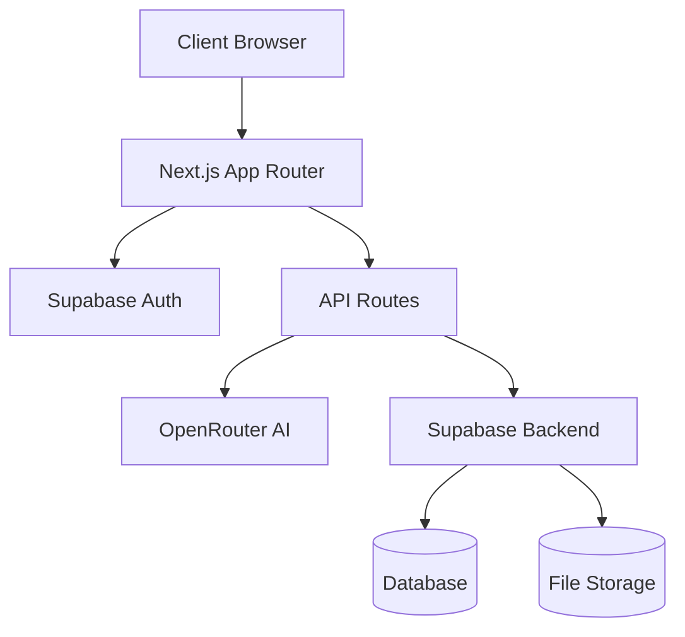

# System Patterns

## Architecture Overview

## Core Technical Patterns

### Authentication Flow

- Supabase handles user authentication
- Protected routes require valid session
- Auth state managed through middleware
- Middleware checks for authentication and redirects to /login if not authenticated

### Data Flow

1. User input captured in React components
2. Server actions process requests
3. OpenRouter API generates AI content
4. Results rendered and optionally stored

### Component Architecture

- Page components in app/ directory
- Reusable UI components in components/
- Utility functions in utils/
- Type definitions in types/

### State Management

- Server components for initial state
- Client components for interactive features
- Supabase real-time updates where needed

### Error Handling

- Dedicated error page component
- Consistent error boundary implementation
- User-friendly error messages

## Design Patterns

### UI/UX Patterns

- Consistent layout structure
- Responsive design with Tailwind
- Progressive enhancement
- Accessibility-first approach

### Code Organization

- Feature-based directory structure
- Clear separation of concerns
- Type-safe interfaces
- Modular component design

## Security Patterns

- Environment variable protection
- API route authentication
- Input validation
- Rate limiting
- CORS policies
